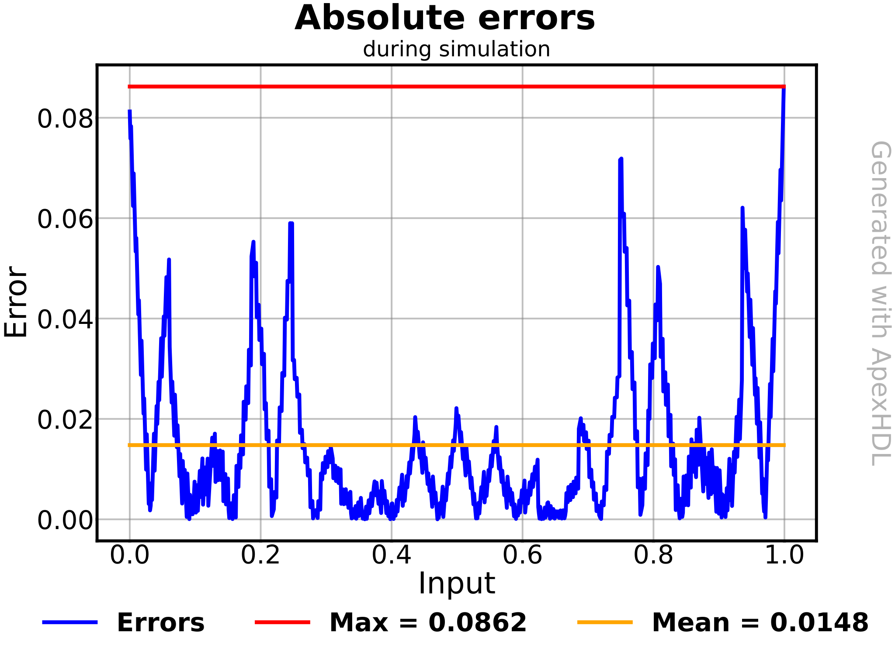
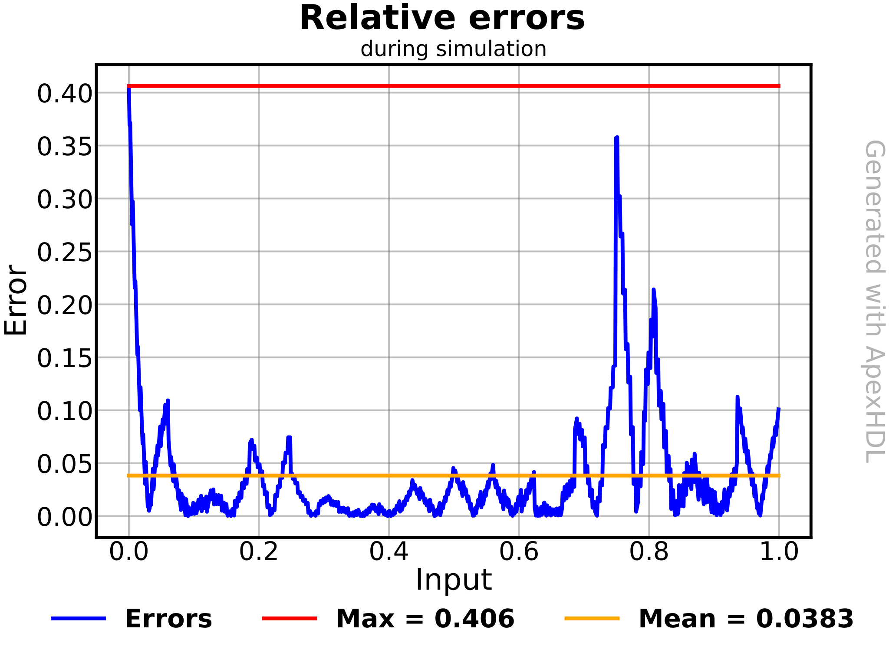
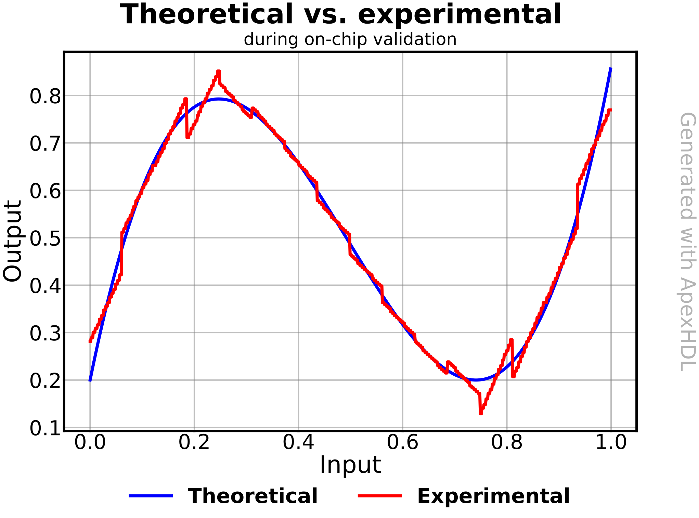
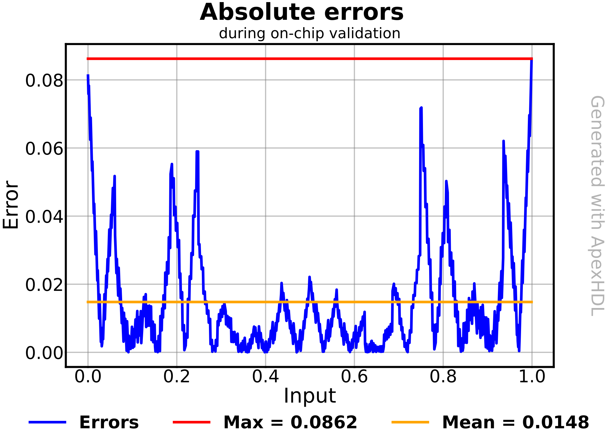
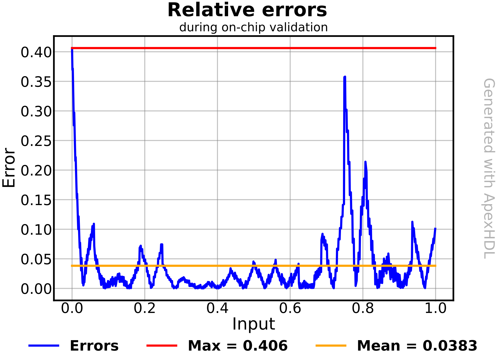

<h1 style="text-align: center;">ApexHDL</h1>

**Automated toolchain** for quick **prototyping**, **validation** and **benchmarking** of **unary and binary function evaluators**. Handles everything for the user, **from the VHDL module generation to the on-chip validation**.

- **Generation** of synthesizable VHDL **module for function evaluation**, using **unary and binary techniques**.
- **Behavioral simulation** and **Python** plotting for **module validation**.
- Standalone synthesis for hardware reporting of **timing and resources metrics**.
- **Hardware-In-the-Loop** process for module **validation on physical silicon**. 
- **Benchmarking** feature for **design exploration** (generation techniques, bits of precision, ...) with **results compiled in a CSV report**.

To guide you through your ApexHDL journey, this repository contains everything needed:

- `doc/` = **Documentation** for ApexHDL set-up, usage, and codebase.
- `src/` =
    - `apexhdl.py` = **Main Python script**, to be called in order to use ApexHDL.
    - `apex/` = Python source code.
- `tcl/` = Tcl scripts, used for **hardware reporting** and **on-chip validation**.
- `xdc/` = XDC constraints scripts, used for **hardware reporting** and **on-chip validation**.

## Using the tool

*Note: The highlights provided in this README come from real execution. For clarity's sake, only the most relevant parts of the inputs/outputs are shown.*

### 1. Define your parameters and call ApexHDL

You may define your parameters either on-the-fly when calling the tool (in the format: `--flag value`), or within a JSON file to save it for later use.

```json
{
    "method_name": "bipartite",
    "circuit_name": "apex_test",
    "output_folder": "../output",
    "step": "all",
    "math_function": "4*((1.35*x-1)**3+(1.35*x-1)**2)+0.2", 
    "x_min": 0,
    "x_max": 1,
    "y_min": 0,
    "y_max": 1,
    "data_width": 8,
    (...)
}
```

You can then call the tool.

```bash
python apexhdl.py --config apex_test.json
```

### 2. Then, the tool takes over, generating your VHDL evaluator...

It generates the synthesizable VHDL code of the evaluator, tailored to your parameters.
```vhdl
entity apex_test is
    port (
        input_a     : in STD_LOGIC_VECTOR(DATA_WIDTH - 1 downto 0);
        result      : out STD_LOGIC_VECTOR(DATA_WIDTH - 1 downto 0)
    );
end apex_test;

architecture arch_apex_test of apex_test is
    (...)
end arch_apex_test;
```

### 3. ... running behavioral simulation

It exhaustively stimulates the evaluator during behavioral simulation. Results are parsed to plot approximation accuracy visualizations.

  

### 4. ... retrieving hardware metrics

It performs standalone synthesis, place and route to retrieve hardware metrics (area, latency).

*(Excerpt from utilization report)*
```
|      Instance     | Module | Total LUTs |
+-------------------+--------+------------+
| top_apex_test     |  (top) |         15 |
(...)
```
*(Excerpt from timinq report)*
```
Timing Report
    Data Path Delay:        8.931ns
(...)
```

### 5. ... testing it on physical silicon

It wraps the evaluator with the appropriate interface, programs it on the target FPGA, exhaustively stimulates it, and parses the results to compute the same visualizations as during simulation. Approximation accuracy should remain the same.

  

### 6. ... and leaving you with a complete report

It compiles all retrieved metrics (accuracy, area, latency) into a comprehensive text report.

```
Results
----------------------
SimMaxAbsError: 0.08621918465850054
SimMeanAbsError: 0.014783697695412
SimMaxRelError: 0.40624999999999994
SimMeanRelError: 0.03827368451958165
LutCount: 15
CriticalPathLatency (ns): 8.931
ImplMaxAbsError: 0.08621918465850054
ImplMeanAbsError: 0.014783697695412
ImplMaxRelError: 0.40624999999999994
ImplMeanRelError: 0.03827368451958165
```

## Running a benchmark

### 1. Define multiple values for one parameter and call ApexHDL

The workflow remains almost the same. Write naturally the different values you want to try for each parameter and call ApexHDL.

```json
{
    "method_name": ["rom", "unary", "hybrid", "bipartite", "symmetric"],
    (...)
}
```

### 2. Then, the tool takes over, running all possible combinations...

The tool automatically computes the different combinations and runs them all, one-by-one.

```bash
apexhdl - INFO - Starting ApexHDL...
apex.runner - INFO - Running config 1 of 5...
apex.runner - INFO - Running config 2 of 5...
apex.runner - INFO - Running config 3 of 5...
apex.runner - INFO - Running config 4 of 5...
apex.runner - INFO - Running config 5 of 5...
```

### 3. ... and leaving you with a complete CSV report

All results are compiled into one CSV to facilitate quantitative comparative analysis.

*(Excerpt of the data presented in the CSV)*
| MethodName  | SimMaxAbsError | SimMeanAbsError | SimMaxRelError | SimMeanRelError | LutCount | CriticalPathLatency (ns) |
| :--: | :--: | :--: | :--: | :--: | :--: | :--: |
| rom | 0.016 | 0.002 | 0.057 | 0.005 | 31 | 7.91 |
| unary | 0.016 | 0.002 | 0.057 | 0.005 | 32 | 7.99 |
| hybrid | 0.016 | 0.002 | 0.057 | 0.005 | 46 | 10.31 |
| bipartite | 0.086 | 0.015 | 0.406 | 0.038 | 15 | 8.93 |
| symmetric | 0.081 | 0.015 | 0.406 | 0.040 | 27 | 9.41 |

## Extending the framework

### a. Add new architectural parameters

Add a new field in the `src/apex/context.py`:
```python
    parameter_name: <param-type> = field(metadata={
        "description": "<param-description>",
        "group": "<param-group>",
        "allow_multiple": <param-multiple-bool>
    })
    """<param-description>"""
```
ApexHDL will automatically deal with all technicalities (args parser, user console manual, ...), letting the developer use it in the code, and the user use it in its configurations. 

### b. Add new functionalities

Create a new Python script in `src/apex/*_stage/variants/`, similar to that *simplified example*, in which you will notably define:
- The selection criteria in the `@register` decorator,
- The Python algorithm in the `execute` function.
```python
@MyRegistry.register(predicate = variant == "my_variant", priority = 1)
class MyVariant(MyStage):
    """
    My super variant
    """
    
    def execute(self, ctx: Context) -> dict[str, float]:
        (...)
```
ApexHDL will automatically integrate your variant into the selection process, ready to be used by the tool.

## Citing this work
- Authors: **Florian DELHON**, **Kevin PEYMANI**, **Tarek OULD-BACHIR**.
- Paper Title: **ApexHDL: A Tool for Generating/Benchmarking Unary and Binary Function Evaluators on FPGA**.
- Conference: **24th IEEE International NEWCAS Conference**, on June 2026, at Chicoutimi, QC, Canada.

## Contributing to the project
- Developer/maintainer: **Florian DELHON**, florian.delhon@polymtl.ca. *Feel free to contact me if you'd like to know more about the tool and eventually contribute to its development!*
